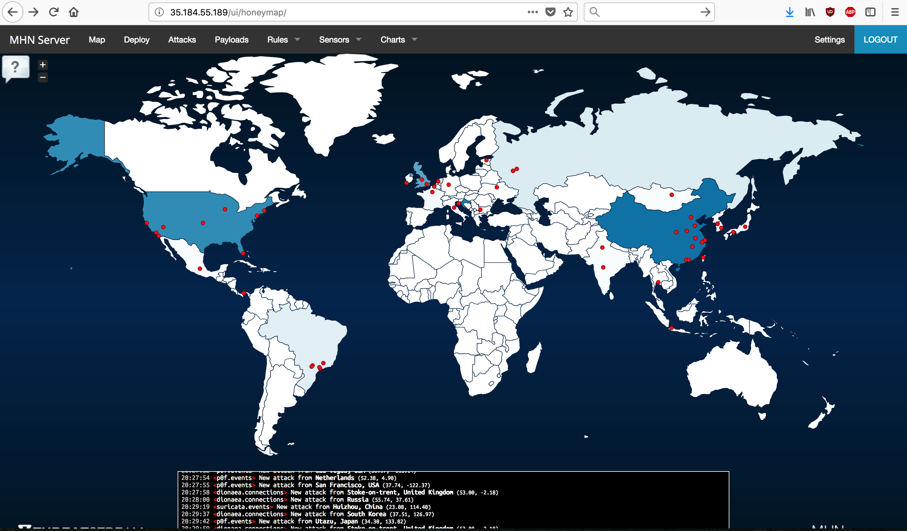
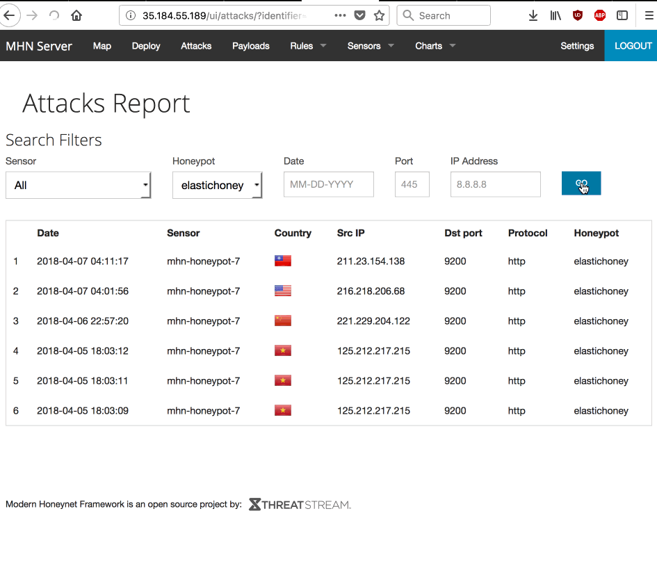

# codepath9 - HoneyPots

Time spent: 6 hours

## HoneyPots Used

1. Dionaea with HTTP - Network Scanners - https://github.com/DinoTools/dionaea
1. Wordpot - Wordpress Attacks - https://github.com/threatstream/mhn/wiki/Wordpot-Sensor
1. p0f - Network Scanners - https://github.com/threatstream/mhn/wiki/p0f-Sensor
1. Cowrie Sensor - Brute Force Attack - https://github.com/threatstream/mhn/wiki/Cowrie-Sensor
1. Suricata Sensor - IDS, IPS and NSM engine - https://github.com/threatstream/mhn/wiki/Suricata-Sensor
1. ElasticHoney Sensor - Remote Code Execution in ES before 1.3.8 - https://github.com/threatstream/mhn/wiki/ElasticHoney-Sensor



## Issues Encountered

I thought that milestone zero wasn't too clear. I've ended up using the following commands:

```
gcloud init # Pick rando name, that is not used
gcloud config set compute/region us-central1
gcloud config set compute/zone us-central1-c
gcloud config list
```

Shortly after, I ran into issue with port 80 not being open on my admin machine. I've removed the custom firewall rule, and re-added with port 80 included in addition to 3000 and 10000.

```
gcloud beta compute firewall-rules create mhn-allow-admin --direction=INGRESS --priority=1000 --network=default --action=ALLOW —rules=tcp:80,tcp:3000,tcp:10000 --source-ranges=0.0.0.0/0 --target-tags=mhn-admin
```

Two out of my 6 honeypots (Wordpot and Cowrie Sensor) did not get any hits. For Wordpot it looks like the installation failed. Cowrie Sensor went down at some point and I was no longer able to SSH into it.

## Summary of data collected



I've set up dionaea right away, and set up the rest of honeypots on Wednesday night. Here are the results for each honeypot that got hits.

|Honeypot|Hits|
|--------|----|
|dionaea|21657
|suricata|5454|
|p0f|2403|
|elastichoney|6|

Here are the most active IPs that have hit my honeypots.

| IP | Count | Attacks | Country|
|----|-------|---------|--------|
| 10.128.0.8|4457|suricata|unknown|
| 199.201.64.145|1965|dionaea|USA|
| 199.201.64.145|1965|dionaea|USA|
| 5.188.11.145|1295|dionaea|Russia|
| 199.201.64.139|992|dionaea|USA|
| 199.201.64.139|992|dionaea|USA|
| 191.101.167.7|764|dionaea|USA|
| 5.62.39.237|658|dionaea|unknown|
| 5.62.39.237|658|dionaea|unknown|
| 5.62.43.21|657|dionaea|unknown|
| 77.72.85.25|512|dionaea|Russia|
| 77.72.85.25|512|dionaea|Russia|
| 5.188.9.25|441|dionaea p0f suricata|Russia|
| 5.188.11.63|410|dionaea p0f suricata|Russia|
|125.212.217.215|17|dionaea elastichoney p0f|Vietnam|

Last IP was not most common, but it was most common out of 6 that attacked the elastichoney.

Elastichoney was a particular interest to me, since my work runs an old version of ElasticSearch. We run it behind a firewall/VPN and it's not as old as 1.4.3 where the vulnerability was fixed. Still it was interesting to see those scanners.

It's also interesting to note that every person that have found the elastichoney vulnerability was careful not to hit all other scans too often. To me this is a sign of a professional. They were able to get the information that they needed, while minimizing the risk of getting their IP blacklisted.

|ip|country|dionaea|p0f|elastichoney|
|--|-------|-------|---|------------|
|125.212.217.215|Vietnam|9|5|3|
|221.229.204.122|China|32|1|1|
|216.218.206.68|USA|2|0|1|
|211.23.154.138|Taiwan|9|4|1|

## Raw Data

Raw data can be found in [session.json](./session.json).